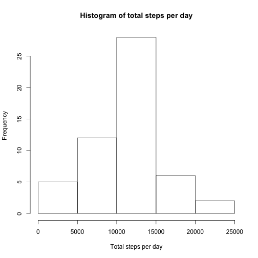
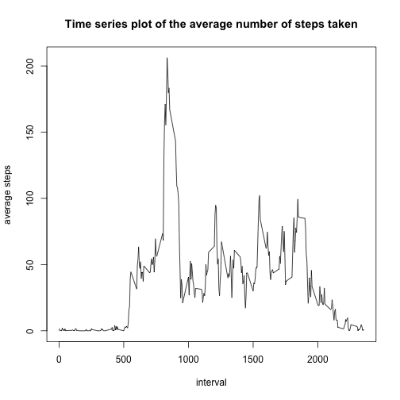
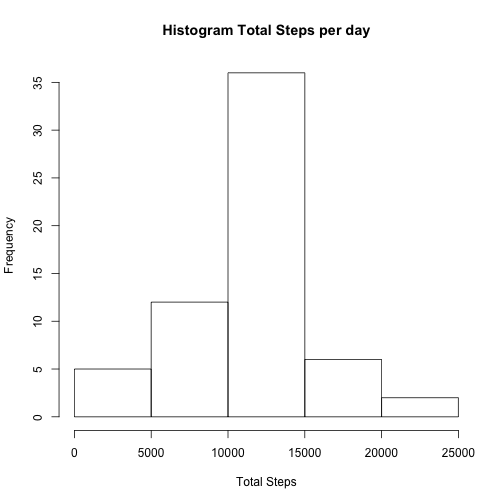
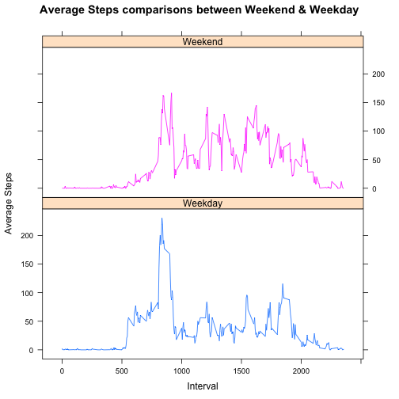

## Activities Analysis Report.

Below is the breif idea about the data.

It is now possible to collect a large amount of data about personal movement using activity monitoring devices such as a Fitbit, Nike Fuelband, or Jawbone Up. These type of devices are part of the “quantified self” movement – a group of enthusiasts who take measurements about themselves regularly to improve their health, to find patterns in their behavior, or because they are tech geeks. But these data remain under-utilized both because the raw data are hard to obtain and there is a lack of statistical methods and software for processing and interpreting the data.

Dataset: [Activity monitoring data](https://d396qusza40orc.cloudfront.net/repdata%2Fdata%2Factivity.zip) [52K]

Breifing about the code.

## Libraries
Below are the libraries which will be used for this course of analysis

```r
library(dplyr)
library(lattice)
```

## Working Directory
Check and set working directory 

```r
# Set Main directory path
maindir <- "/Users/mycomputer"
# Set Working directory path
path <- paste(maindir, "/Documents", sep = "")

# Check if desired working directory path exist or not
# if exist then set working directory else create directory and set it accordingly
if (dir.exists(file.path(path))){
        setwd(file.path(path))
}else {
        dir.create(file.path(maindir, "Documents"))
        setwd(file.path(path))
}
```

## Source File
Source dataset will be downloaded using below code. The downloaded file is a zip file, hence it needs to be unzipped for us to read the source file.

```r
# Download the dataset to work on
fileurl <- "https://d396qusza40orc.cloudfront.net/repdata%2Fdata%2Factivity.zip"
download.file(fileurl, destfile = "repdataactivity.zip")

# As the dataset is in zip folder, unzip command is used to unzip the file
zipf <- paste(path, "/repdataactivity.zip", sep = "")
outdir <- paste(path, "/repdataactivity", sep = "")
unzip(zipf, exdir = outdir)
```

## Reading Source File (Question 1)

The unzipped source file is then read using read.csv function and stored in "activity" dataframe. Date variable is converted into date datatype. A new dataframe (no.na.activity) is formed omitting the "NA" values.


```r
filepath <- paste(outdir, "/activity.csv", sep = "")

activity <- read.csv(filepath, header = TRUE, sep = ",", stringsAsFactors = FALSE)

activity$date <- as.Date(as.character(activity$date))
no.na.activity <- activity[complete.cases(activity), ]
```

## Question 2 : Histogram of the total number of steps taken each day

Total number of steps per day are calculated using "dplyr" library functions and stored in "totalstepsperday" dataframe. hist() function is used to plot the histogram as required 

```r
totalstepsperday <- no.na.activity %>% group_by(date) %>% summarize(totalsteps = sum(steps))

hist(totalstepsperday$totalsteps, xlab = "Total steps per day", main = "Histogram of total steps per day")
```



## Question 3 : Mean and median number of steps taken each day

Mean and Medians of steps per day are calculated using "mean" & "median" functions and "totalstepsperday" functions. Rememeber we had stored the total steps based on dates group in "totalstepsperday" dataframe.

```r
mean.stepsperday <- mean(totalstepsperday$totalsteps)
print(paste("mean.stepsperday = ", mean.stepsperday))
```

```
## [1] "mean.stepsperday =  10766.1886792453"
```

```r
median.stepsperday <- median(totalstepsperday$totalsteps)
print(paste("median.stepsperday = ", median.stepsperday))
```

```
## [1] "median.stepsperday =  10765"
```

## Question 4 : Time series plot of the average number of steps taken

Average number of steps are calculated base on the intervals avaiable in the data source. Again this calculation is done using "dplyr" library functions. This data is stored in "averagesteps" dataframe. Using base plotting system, plot is drawn for avgsteps against interval.

```r
averagesteps <- no.na.activity %>% group_by(interval) %>% summarize(avgsteps = mean(steps))

with(averagesteps, plot(interval,
                        avgsteps,
                        type = "l",
                        xlab = "interval",
                        ylab = "average steps",
                        main = "Time series plot of the average number of steps taken"))
```



## Question 5 : The 5-minute interval that, on average, contains the maximum number of steps

Using which.max function maximum avgsteps per interval index value is calculated. This value is then used to subset the respected row which will show the interval which has maximum average steps amongst all.

```r
as.data.frame(averagesteps[which.max(averagesteps$avgsteps), ])
```

```
##   interval avgsteps
## 1      835 206.1698
```

## Question 6 : Code to describe and show a strategy for imputing missing data

This question is done in 3 phases,

1. Using our original dataframe (contains NA & not NA values), all the rows with "NA" values in steps variables are subsetted and stored in a new dataframe i.e. "na.activity". Using "nrow" function total number of "NA" rows are calcuted. 

2. Then to replace the "NA" values with average steps per interval, "na.activity" dataframe is joined with "averagesteps" using left_join function, these 2 dataframes are joined based on interval column. Then steps variables values (which are "NA") are assigned values of avgsteps variables. Finally, "na.activity" dataframe is left with 3 required variables "steps, date, interval".

3. Now that we have assigned/replaced "NA" a valid values, it is been row bind with no.na.activity dataframe using "rbind" function. Final dataset is soterd in "activities" dataframe. Using this dataframe again total number of steps are calculated per date and stored in na.totalstepsperday dataframe.

```r
# 1
na.activity <- activity[is.na(activity$steps),]
nrow(na.activity)
```

```
## [1] 2304
```

```r
# 2
na.activity <-  na.activity %>% left_join(averagesteps)
```

```
## Joining, by = "interval"
```

```r
na.activity$steps <- na.activity$avgsteps
na.activity <- select(na.activity, -avgsteps)

# 3
activities <- rbind(na.activity, no.na.activity)
na.totalstepsperday <- activities %>% group_by(date) %>% summarize(totalsteps = sum(steps))
```

## Question 7 : Histogram of the total number of steps taken each day after missing values are imputed

Using na.totalstepsperday dataframe, an histogram is plotted to show frequency of total number of steps per day.
Along with this again the Mean & Median is calculated to compare them with our previous results.

```r
hist(na.totalstepsperday$totalsteps,
     xlab = "Total Steps",
     main = "Histogram Total Steps per day")
```



```r
na.mean.stepsperday <- mean(na.totalstepsperday$totalsteps)
print(paste("na.mean.stepsperday = ", na.mean.stepsperday))
```

```
## [1] "na.mean.stepsperday =  10766.1886792453"
```

```r
na.median.stepsperday <- median(na.totalstepsperday$totalsteps)
print(paste("na.median.stepsperday = ", na.median.stepsperday))
```

```
## [1] "na.median.stepsperday =  10766.1886792453"
```

## Question 8 : Panel plot comparing the average number of steps taken per 5-minute interval across weekdays and weekends

To solve this, 2 additional variables named "weekday" & "weekend" are added to our dataset.
Weekday is assigned value of the name of the day using "weekdays" function with "date" variable as lone argument. This weekday values are then used to define if the readings taken are for week day or weekend, which is stored in "weekend" variable. A function "daytype" is used to perform this calculation.
Having defined necessary variables for the question, then "xyplot" function of "lattice" library is used to create a panel plot for weekday and weekend and the data plotted in it is total steps against the interval

```r
daytype <- function(day) {
        if  (!(day == 'Saturday' || day == 'Sunday')) {
                x <- 'Weekday'
        } else {
                x <- 'Weekend'
        }
        x
}

activities$weekday <- weekdays(activities$date)
activities$weekend <- as.factor(sapply(activities$weekday, daytype))

average.steps <- activities %>% group_by(weekend, interval) %>% summarize(avgsteps = mean(steps))

xyplot(avgsteps ~ interval | weekend, 
       group = weekend, data = average.steps,
       type = c("l"),
       layout = c(1,2),
       xlab = "Interval",
       ylab = "Average Steps",
       main = "Average Steps comparisons between Weekend & Weekday")
```


